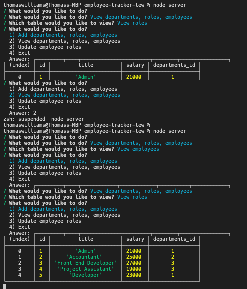

# Employee Tracker

## Table of Contents
  
* [Description](#description)
* [Installation](#installation)
* [Usage](#usage)
* [Contributing](#contributing)
* [Tests](#tests)
* [Questions](#questions)
* [License](#license)
  
## Description 
  
A professional content management system (CMS) that offers a solution for managing a company's employees and their personal data. It has been built using node, inquirer, and MySQL.

A series of steps in the command line allow the user to input data for departments, employee roles and for individual employees. 

The data can be viewed in the terminal through the console.table package. 

The employee role can also be updated on the database as necessary.

## Installation
  
To install the project please use the following package manager: 
  
enter 'npm init' in the terminal 

enter 'npm install mysql' to install the express dev dependency

enter 'npm install table.console' to install the table.console dev dependency

enter 'npm install inquirer' to install the inquirer dev dependency

  
## Usage
  
Download, install NPM packages, enter node server.js to activate server and run the app

## Contributing
  
To contribute further on this project please:
  
n/a 
  
## Tests
  
n/a 
  
## Questions
  
For any further questions, please contact GitHub user: 
[ThomWilliams](https://www.github.com/ThomWilliams/) 

Or for direct enquiries please email the follower developer address: 
thomwilliams1990@gmail.com 
  

## Screenshot

## Walkthrough Video

- [Watch Video]()

## Deployment / Links

- Project Repository: [GitHub](https://github.com/ThomWilliams/employee-tracker-tew)

- Issue tracker: [GitHub Issues](https://github.com/ThomWilliams/employee-tracker-tew/issues)

## License
  
MIT 

Copyright (c) [2021] [Thomas Edward Williams]

Permission is hereby granted, free of charge, to any person obtaining a copy
of this software and associated documentation files (the "Software"), to deal
in the Software without restriction, including without limitation the rights
to use, copy, modify, merge, publish, distribute, sublicense, and/or sell
copies of the Software, and to permit persons to whom the Software is
furnished to do so, subject to the following conditions:

The above copyright notice and this permission notice shall be included in all
copies or substantial portions of the Software.

THE SOFTWARE IS PROVIDED "AS IS", WITHOUT WARRANTY OF ANY KIND, EXPRESS OR
IMPLIED, INCLUDING BUT NOT LIMITED TO THE WARRANTIES OF MERCHANTABILITY,
FITNESS FOR A PARTICULAR PURPOSE AND NONINFRINGEMENT. IN NO EVENT SHALL THE
AUTHORS OR COPYRIGHT HOLDERS BE LIABLE FOR ANY CLAIM, DAMAGES OR OTHER
LIABILITY, WHETHER IN AN ACTION OF CONTRACT, TORT OR OTHERWISE, ARISING FROM,
OUT OF OR IN CONNECTION WITH THE SOFTWARE OR THE USE OR OTHER DEALINGS IN THE
SOFTWARE.

